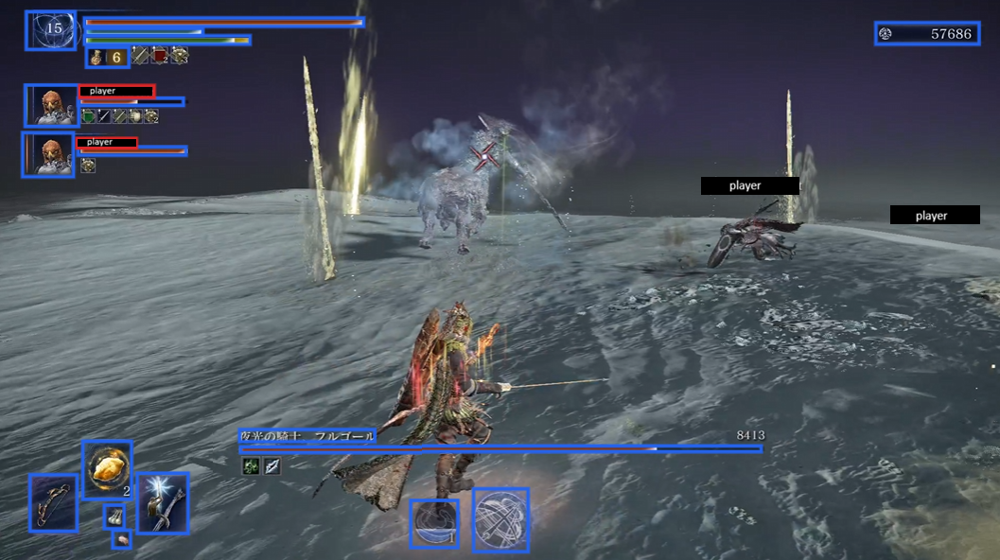
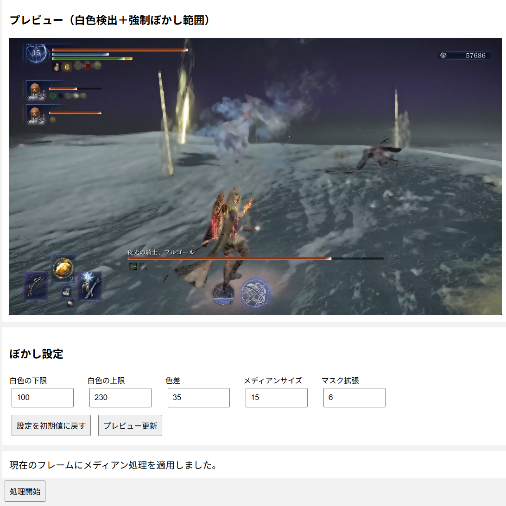

# Video Blur Tool

動画（mkv,mp4）内の白色部分を自動検出し、指定した範囲を除外・強制指定しながらぼかし処理を行うWebアプリです。

ブラウザ上で動画を読み込み、プレビューを確認してから動画を処理できます。

オンラインゲームゲームの他プレイヤーのネームにモザイクをかける目的で開発しました。

現実的な処理時間に収めるために、プレイヤーネームの文字が白色であることを利用し、白色を検出してモザイクをかけます。

そのため、不要な個所にもモザイクがかかる弱点があります。

## スクリーンショット





## 主な機能

- 動画ファイルの読み込み
- 動画内の白色部分を自動検出
- 検出した部分にぼかし処理
- ぼかし方式の選択
  - モザイク
  - ガウシアンぼかし
- 白色判定の調整
- 除外範囲の指定
- 強制ぼかし範囲の指定
- 指定した枠をクリックして削除
- 処理前のプレビュー
- 処理状況のプログレスバー
- 元動画の音声を保持
- 処理後の動画をブラウザから再生・保存

## 動作環境

- Python 3.10 以降
- FFmpeg
- Windows / Linux など
- Webブラウザ

## 必要なPythonパッケージ

- Flask
- OpenCV
- NumPy

## インストール

### 1. リポジトリを取得
```bash
git clone https://github.com/omesoftwarelab/video-blur-tool.git
cd video-blur-tool
```

### 2. Pythonパッケージをインストール
```bash
pip install -r requirements.txt
```

### 3. FFmpegをインストール

FFmpegがPATHから実行できる状態にしてください。
```bash
ffmpeg -version
ffprobe -version
```

## 起動
```bash
python app.py
```

ブラウザで以下を開きます。
http://127.0.0.1:5000

## 使い方
1. 動画ファイルを選択します。
2. 動画が読み込まれると、最初のフレームが自動的にプレビューされます。
3. 「除外範囲を追加」または「強制ぼかし範囲を追加」を選択します。
4. 動画上をドラッグして範囲を指定します。
5. 指定した枠をクリックすると、その枠を削除できます。
6. ぼかし設定を変更した場合は「プレビュー更新」を押します。
7. 「処理開始」を押します。
8. プログレスバーで処理状況を確認します。
9. 処理完了後、「完成動画を開く」から動画を確認できます。

## ぼかし処理

### 1.白色検出
動画の各フレームから白色部分を検出してぼかします。
「白色の下限」「白色の上限」「色差」を調整できます。

### 2.除外範囲
白色として検出された場所でも、指定した範囲はぼかしません。

### 3.強制ぼかし範囲
白色として検出されなかった場所でも、指定した範囲をぼかします。

### 4.ぼかし方式
モザイク:
画像を縮小してから拡大することでモザイク処理を行います。

ガウシアン:
OpenCVのGaussian Blurを使用してぼかします。

## ディレクトリ構成

```text
.
├── app.py
├── requirements.txt
├── README.md
├── .gitignore
├── templates/
│   └── index.html
├── tmp/
└── outputs/
```

tmp/ と outputs/ は動画処理用の一時ファイル・出力ファイルを保存するディレクトリです。

これらの動画ファイルはGitHubには登録しないことを推奨します。

## 注意事項
動画の解像度や長さによっては、処理に時間がかかります。
白色検出は映像の内容によって結果が変わるため、実際の動画を確認しながら設定値を調整してください。

## 使用技術
- Python
- Flask
- OpenCV
- NumPy
- FFmpeg
- HTML / CSS / JavaScript

## License
This project is licensed under the MIT License.
